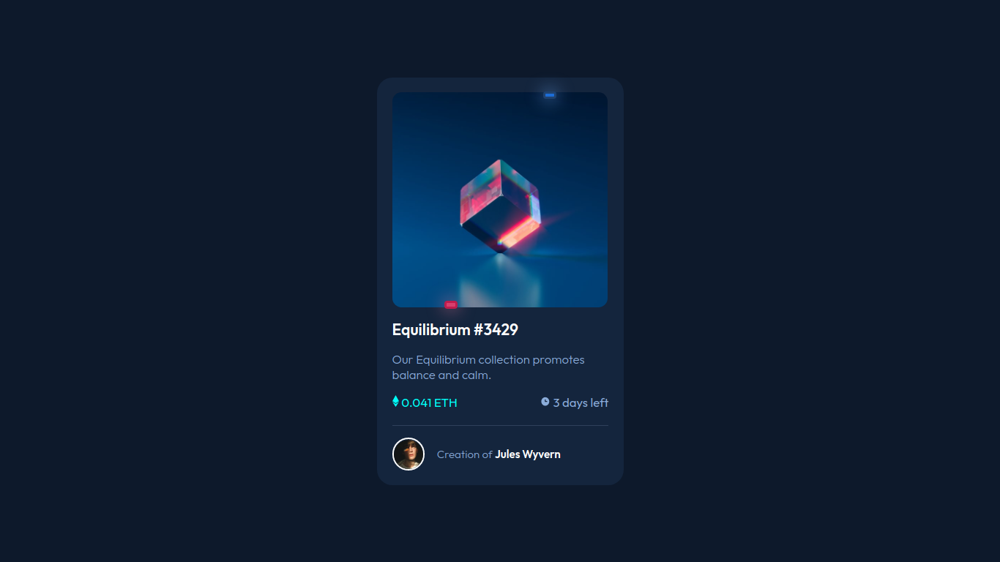
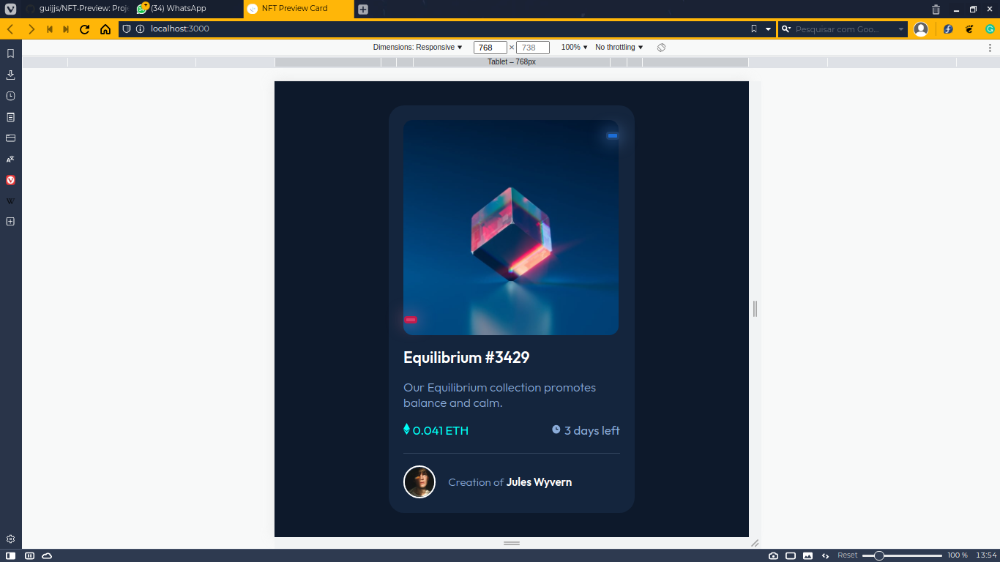
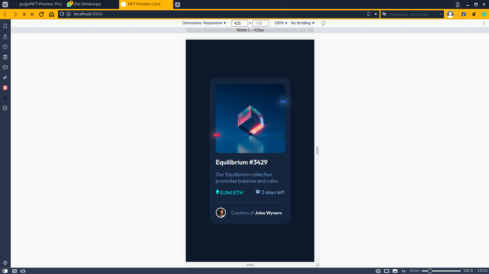

<h1>Hello there! Welcome!</h1>

# Frontend Mentor - NFT preview card component solution

This is a solution to the [NFT preview card component challenge on Frontend Mentor](https://www.frontendmentor.io/challenges/nft-preview-card-component-SbdUL_w0U). Frontend Mentor challenges help you improve your coding skills by building realistic projects. 

## Table of contents

- [Overview](#overview)
  - [The challenge](#the-challenge)
  - [Screenshot](#screenshot)
  - [Links](#links)
  - [Built with](#built-with)
  - [What I learned](#what-i-learned)
  - [Continued development](#continued-development)
- [Author](#author)


## Overview

### The challenge

Users should be able to:

- View the optimal layout depending on their device's screen size
- See hover states for interactive elements

### Screenshot

<h4>PC Screenshot</h4>


<h4>Tablet</h4>


<h4>Large Smartphone</h4>


<h4>Small Smartphone</h4>


### Links

- Solution URL: [GitHub Repository](https://github.com/guijjs/NFT-Preview)
- Live Site URL: [Live Site URL](https://guijjs.github.io/NFT-Preview/)

### Built with

- HTML5
- Sass
- Flexbox

### What I learned

```scss
.proud-of-this-css {
    /*card main image area*/
    .nft--apresentation{
    display: flex;
    flex-direction: column;
    /*div for style*/
    .main--image{
        position: relative;
        /*Animations for better apresentation*/
        @keyframes ta {
            0%{
                top: -1.5%;
                right: 0;
            }
            20%{
                top: -1.5%;
                right: 93.5%;
            }

            40%{
                top: 97%;
                right: 93.5%;
            }
            60%{
                top: 97%;
                right: -95;
            }
            80%{
                top: 97%;
                right: 0;

            }
            100%{
                top: -1.5%;
                right: 0;
            }
        }
        /*Animations for better apresentation*/
        @keyframes tb {
            0%{
                bottom: -1.5%;
                left: 0;
            }
            20%{
                bottom: -1.5%;
                left: 93.5%;
            }

            40%{
                bottom: 97%;
                left: 93.5%;
            }
            60%{
                bottom: 97%;
                left: -95;
            }
            80%{
                bottom: 97%;
                left: 0;

            }
            100%{
                bottom: -1.5%;
                left: 0;
            }
        }
        /*Object animated*/
        &::after{
            position: absolute;
            content: '';
            border: solid;
            border-color: #BE1C4D;
            top: -1.5%;
            right: 0;
            height: 5px;
            width: 15px;
            background-color: #D83F6D;
            border-radius: 0.45rem;
            filter: drop-shadow(0 0 1.4rem rgb(225, 119, 151));

            animation-name: ta;
            animation-duration: 2s;
            animation-iteration-count: infinite;
        }
        /*Object animated*/
        &::before{
            position: absolute;
            content: '';
            border: solid;
            border-color: #20426E;
            bottom: -1.5%;
            left: 0;
            height: 5px;
            width: 15px;
            background-color: #1C6DD7;
            border-radius: 0.45rem;
            filter: drop-shadow(0 0 1.4rem rgb(109, 167, 243));
            
            animation-name: tb;
            animation-duration: 2s;
            animation-iteration-count: infinite;
        }
        /*Principal Image*/
        .image--aaa{
            img{
                display: block;
                width: 35rem;
                border-radius: 1.5rem;
                align-self: center;
                @include small--smartphone{
                    width: 27.5rem;
                    align-self: center;
                }
            }
        }
        /*Hover of principal image*/
        .image--hover{
            position: absolute;
            width: 99.5%;
            height: 100%;
            transition: 0.70s;
            display: flex;
            justify-content: center;
            align-items: center;
            border-radius: 1.5rem;
            @include small--smartphone{
                width: 101%;
            }
            img{
                opacity: 0;
                transition: 0.70s;
            }
            top: 0;
            &:hover{
                img{
                    opacity: 100;
                }
                display: flex;
                position: absolute;
                width: 99.5%;
                height: 100%;
                background-color: rgba(0, 255, 247, 0.25%);
                top: 0;
                right: 0;
                bottom: 0;
                left: 0;
                display: flex;
                justify-content: center;
                align-items: center;
                cursor: pointer;
                @include small--smartphone{
                    width: 101%;
                }
            }
        }
    }
    /*Title*/
    h1{
        margin-top: 2rem;
        transition: 0.45s;
        &:hover{
            color: $cyan;
            cursor: pointer;
        }
    }
    }
}
```

### Continued development

I wanna develop more landing pages, for my apprenticeship.

## Author

- Website - [Jackson Guilherme](https://github.com/guijjs)
- Frontend Mentor - [@guijjs](https://www.frontendmentor.io/profile/guijjs)
